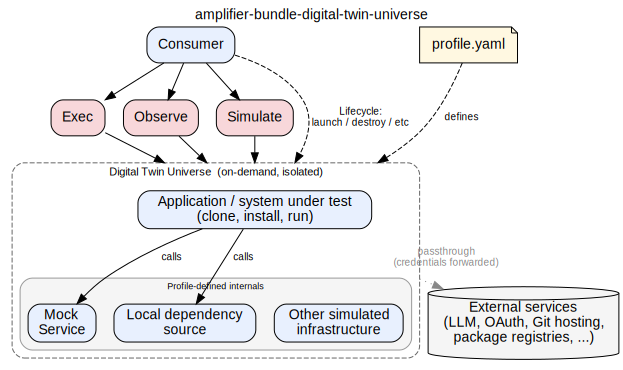
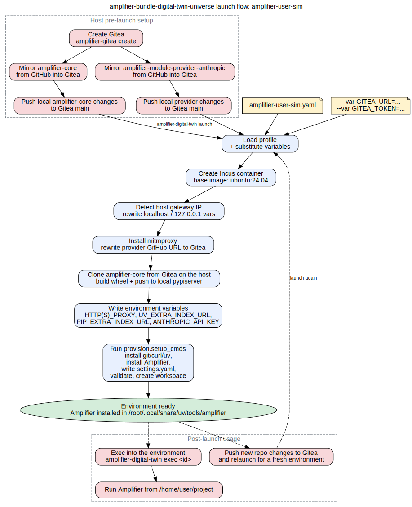

# Amplifier Bundle Digital Twin Universe (DTU)

By default AI generated software is verified in the environment and context that it was built. 
This frequently leads to agents claiming it worked due to context poisoning, 
leaving issues unsolved since they are not forced to consider deployment details, or specific setup present on the dev machine. 
This leaves a gap between "tests pass" and "this actually meets all the requirements and works in a real-world scenario."

Let's take integrating with an app like Teams as an example. 
We might build something that integrates with it and for our day-to-day use we would have to make an account, an app registration, etc. 
In a software factory, agents are constantly creating new app registrations, which may exceed rate limits, require manual setup, etc. 
Having a mocked Teams service in a digital twin universe allows us to development against it without issue. 
It also allows us to instrument such or add additional testing hooks and so on to help with our development/visibility needs, etc.

Amplifier Digital Twin Universe is made to close that gap: a complete, isolated environment, 
stood up on demand from a declarative profile, that simulates the world the code will live in, 
so consumers can clone, install, run, and experience it like a real user.
It answers "What reality will be like if this was actually deployed?" 
in a way that an everyday person can understand and interact without deep technical knowledge or special setup.




## Profiles

A DTU is defined by a profile which is a YAML file that declares the 
services, networking, and provisioning needed to launch a complete environment.

See [docs/profiles.md](docs/profiles.md) for the full profile reference and [profiles/](profiles/) for examples.

### Example: amplifier-user-sim

The [amplifier-user-sim](profiles/amplifier-user-sim.yaml) profile simulates an Amplifier user
environment: LLM API passthrough, repos served from Gitea, the Amplifier CLI installed,
and the Anthropic provider pre-configured so Amplifier is ready to use immediately.




## Installation

### Prerequisites

- Python 3.11+
- [uv](https://docs.astral.sh/uv/) (package manager and runner)
- [Incus](https://linuxcontainers.org/incus/) (container runtime) -- see [Installing Incus](#installing-incus) below

### CLI

```bash
uv tool install git+https://github.com/microsoft/amplifier-bundle-digital-twin-universe@main
```

### Amplifier Bundle

TBD. Later we will have skills and context related to how Amplifier can consume this, setup it up for the user, etc.


## Quick Start

```bash
# Launch an environment from a profile
amplifier-digital-twin launch amplifier-user-sim

# Execute a command inside it
amplifier-digital-twin exec dtu-a1b2c3d4 -- amplifier --version

# Interactive shell
amplifier-digital-twin exec dtu-a1b2c3d4

# Tear it down
amplifier-digital-twin destroy dtu-a1b2c3d4
```

All commands return JSON to stdout. See [docs/api-reference.md](docs/api-reference.md) for the full API.


## Features

- **Profile-driven environments.** A single YAML profile declares the services, networking, and provisioning for a complete environment. 
Profiles are self-contained and launchable on their own.

- **Passthrough for real APIs.** External services that are stateless or read-only (LLM APIs, package registries, etc.) are proxied through the environment boundary with forwarded credentials rather than mocked.

- **DNS rewriting.** Services within the environment can be addressed by their real-world hostnames. 
DNS rewriting and URL redirection make mock services feel like the real thing to code running inside.

- **Human access.** Users can interact with a running environment and experience it as close to the real thing as possible -- launching apps, clicking through UIs, interacting with services. 
The mechanism is TBD (remote desktop, remote shell + browser sessions, or something in between) but the goal is that a general info worker could intuit and "get it."

- **Agent interaction surfaces.** Agents can reach into the environment from the outside and drive "as a user" experiences via browser-tester, terminal-tester, and similar mechanisms. 
Mock services can advertise affordances (coordinates, API hooks) so agents interact through the same surfaces as human users.

- **Ephemeral lifecycle.** Environments are created, used, and destroyed on demand. Consumers can wipe and restart for a clean simulation at any time.

- **CLI-first, JSON output.** All lifecycle commands (create, status, destroy) return JSON to stdout for programmatic consumption.

- **Mock service catalog (TBD)** Profiles reference mock services from a catalog of pre-built images. 
Mock services can stand in for real external services (M365, Slack, GSuite, etc.) allowing unlimited use without rate limits, app registration overhead, or cost.


## Installing Incus

Incus is the container runtime used by the Digital Twin Universe.

### Ubuntu / WSL2 (Ubuntu 24.04+)

```bash
# Install
sudo apt update && sudo apt install -y incus

# Initialize with defaults
sudo incus admin init --minimal

# Grant your user permission to manage containers
sudo usermod -aG incus-admin $USER
newgrp incus-admin
```

Verify:

```bash
incus version                                          # should show Client + Server versions
incus launch images:ubuntu/24.04 test-hello            # create a test container
incus exec test-hello -- echo "hello from container"   # run a command inside it
incus delete test-hello --force                         # clean up
```

If `incus version` shows `Server version: unreachable`, your shell session
doesn't have the `incus-admin` group yet. Run `newgrp incus-admin` or log out
and back in.

### WSL2 networking (Docker + Incus)

If Docker is also installed on the same WSL2 instance, by default it might set the kernel's FORWARD chain policy to DROP when it starts. 
This blocks all forwarded traffic including Incus bridge traffic and incus containers will fail to reach the internet.
To fix this run:

```bash
# Configure Docker to leave the FORWARD chain alone
echo '{"ip-forward-no-drop": true}' | sudo tee /etc/docker/daemon.json

# Restart WSL to make sure the change is applied
wsl --shutdown
```

### Other Platforms

See the [Incus installation docs](https://linuxcontainers.org/incus/docs/main/installing/).


## Development

For development setup and test workflows, see
[docs/development.md](docs/development.md).

For a full manual walkthrough of spinning up Gitea, mirroring repos,
launching an environment, and using Amplifier inside it, see
[docs/manual_verification.md](docs/manual_verification.md).
