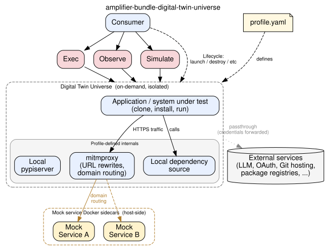

# Amplifier Bundle Digital Twin Universe (DTU)

> This project still in very early stages. Assume that every interface, CLI commands, profile schema, JSON output shapes, etc. is subject to change.

By default AI generated software is verified in the environment and context that it was built. 
This frequently leads to agents claiming it worked due to context poisoning, 
leaving issues unsolved since they are not forced to consider deployment details, or specific setup present on the dev machine. 
This leaves a gap between "tests pass" and "this actually meets all the requirements and works in a real-world scenario."

Let's take integrating with an app like Teams as an example. 
We might build something that integrates with it and for our day-to-day use we would have to make an account, an app registration, etc. 
In a software factory, agents are constantly creating new app registrations, which may exceed rate limits, require manual setup, etc. 
Having a mocked Teams service in a digital twin universe allows us to development against it without issue. 
It also allows us to instrument such or add additional testing hooks and so on to help with our development/visibility needs, etc.

Amplifier Digital Twin Universe is made to close that gap: a complete, isolated environment, 
stood up on demand from a declarative profile, that simulates the world the code will live in, 
so consumers can clone, install, run, and experience it like a real user.
It answers "What reality will be like if this was actually deployed?" 
in a way that an everyday person can understand and interact without deep technical knowledge or special setup.




## Profiles

A DTU is defined by a profile which is a YAML file that declares the 
services, networking, and provisioning needed to launch a complete environment.
To share profiles alongside a repo, `.amplifier/digital-twin-universe/profiles/` is the convention.
For example, we have a sample profile for validating this repo locally at [.amplifier/digital-twin-universe/profiles/digital-twin-bundle-self-validation-profile.yaml](.amplifier/digital-twin-universe/profiles/digital-twin-bundle-self-validation-profile.yaml)

See [docs/profiles.md](docs/profiles.md) for the full profile reference and [profiles/](profiles/) for examples.

Profiles can include mock services as Docker sidecars with transparent DNS rewriting.
See [docs/mock-authoring.md](docs/mock-authoring.md) for how to build a mock and a list of community mocks.

### Example: amplifier-user-sim

The [amplifier-user-sim](profiles/amplifier-user-sim.yaml) profile simulates an Amplifier user
environment: LLM API passthrough, repos served from Gitea, the Amplifier CLI installed,
and the Anthropic provider pre-configured so Amplifier is ready to use immediately.
See the [launch flow diagram](docs/amplifier-user-sim-launch-flow.svg) for details.

### Example: amplifier-chat

The [amplifier-chat profile](profiles/amplifier-chat.yaml) launches a browser-accessible
[amplifier-chat UI](https://github.com/microsoft/amplifier-chat) backed by amplifierd. 
It installs the app from upstream, configures the Anthropic provider, 
and uses `access.ports` to forward port 8410 to `localhost` so you can open 
`http://localhost:8410/chat/` in your browser immediately after launch.

```bash
amplifier-digital-twin launch amplifier-chat
# => {"access": [{"label": "Chat UI", "url": "http://localhost:8410/chat/"}], ...}
```


## Installation

### Prerequisites

- Python 3.11+
- [uv](https://docs.astral.sh/uv/) (package manager and runner)
- [Incus](https://linuxcontainers.org/incus/) (container runtime) -- see [docs/installing-incus.md](docs/installing-incus.md)
- [Docker Engine](https://docs.docker.com/engine/install/) (for Gitea repos and mock service sidecars) -- see [docs/installing-docker.md](docs/installing-docker.md)

### CLI

```bash
uv tool install git+https://github.com/microsoft/amplifier-bundle-digital-twin-universe@main
```

### Amplifier Bundle

This repo is also an Amplifier bundle. The bundle provides a `digital-twin-universe` skill and context awareness so the AI model knows how to use the `amplifier-digital-twin` CLI. 
The CLI must be installed separately (see above).

For interactive Amplifier sessions, install as an app bundle (recommended):
```bash
amplifier bundle add git+https://github.com/microsoft/amplifier-bundle-digital-twin-universe@main --app
```

To compose into an existing bundle:
```bash
amplifier bundle add "git+https://github.com/microsoft/amplifier-bundle-digital-twin-universe@main#subdirectory=behaviors/digital-twin-universe.yaml"
```

Otherwise, consider using the CLI directly.


## Quick Start

```bash
# Launch an environment from a profile
amplifier-digital-twin launch amplifier-user-sim

# Execute a command inside it
amplifier-digital-twin exec dtu-a1b2c3d4 -- amplifier --version

# Update provisioned software without restarting the environment
amplifier-digital-twin update dtu-a1b2c3d4

# Interactive shell
amplifier-digital-twin exec dtu-a1b2c3d4

# Check environment status
amplifier-digital-twin status dtu-a1b2c3d4

# List all managed environments on this machine
amplifier-digital-twin list

# Tear down a specific environment (use the id from your launch output)
amplifier-digital-twin destroy dtu-a1b2c3d4
```

All commands return JSON to stdout. See [docs/api-reference.md](docs/api-reference.md) for the full API.


## Features

- **Profile-driven environments.** A single YAML profile declares the services, networking, and provisioning for a complete environment. 
Profiles are self-contained and launchable on their own.

- **Passthrough for real APIs.** External services that are stateless or read-only (LLM APIs, package registries, etc.) are proxied through the environment boundary with forwarded credentials rather than mocked.

- **DNS rewriting.** Services within the environment can be addressed by their real-world hostnames. 
DNS rewriting and URL redirection make mock services feel like the real thing to code running inside.

- **Human access.** Profiles can declare `access.ports` to forward ports from the container to `localhost` on the host via Incus proxy devices. 
This works seamlessly on WSL2 (Windows auto-forwards WSL2 localhost ports to the Windows host). 
Users can open a browser and interact with web apps running inside the environment as if they were local.

- **Agent interaction surfaces.** Agents can reach into the environment from the outside and drive "as a user" experiences via browser-tester, terminal-tester, and similar mechanisms. 
Mock services can advertise affordances (coordinates, API hooks) so agents interact through the same surfaces as human users.

- **Ephemeral lifecycle.** Environments are created, used, and destroyed on demand. Consumers can wipe and restart for a clean simulation at any time.

- **In-place updates.** Profiles can define an `update` section with commands to pull fresh code and reinstall without destroying the environment. PyPI overrides can be rebuilt automatically. This enables a fast `launch` -> `update` -> `test` iteration loop.

- **CLI-first, JSON output.** All lifecycle commands (launch, update, status, list, destroy) return JSON to stdout for programmatic consumption.

- **Amplifier agents.** The bundle includes agents for working with DTU environments within Amplifier sessions.
  - [`dtu-profile-builder`](agents/dtu-profile-builder.md) explores a user's project repository, generates a complete DTU profile, launches the environment, and hands back access details.
  - [`dtu-browser-tester`](agents/dtu-browser-tester.md) drives a real browser against web UIs running inside a DTU to verify they work end-to-end.

- **Amplifier skill.** The bundle ships a `digital-twin-universe` [skill](skills/) for help installing the CLI, understanding profiles, and using environments within Amplifier sessions.

- **Mock service sidecars.** Profiles can declare `mock_services` that are resolved (cloned or local), built into Docker images, and started as sidecar containers alongside the Incus environment. 
mitmproxy routes traffic for declared domains from inside the environment to the mock, including WebSocket upgrades. 
See [docs/profiles.md](docs/profiles.md#mock_services) for the `mock_services` schema and mock manifest format.

- **Mock service catalog (TBD).** A catalog of pre-built mock images for common external services (M365, Slack, GSuite, etc.) allowing for testing without rate limits, manual app registration overhead, etc.


## Development

For development setup and test workflows, see
[docs/development.md](docs/development.md).

For a full manual walkthrough of spinning up Gitea, mirroring repos,
launching an environment, and using Amplifier inside it, see
[docs/manual_verification.md](docs/manual_verification.md).

## Contributing

> [!NOTE]
> This project is not currently accepting external contributions, but we're actively working toward opening this up. We value community input and look forward to collaborating in the future. For now, feel free to fork and experiment!

Most contributions require you to agree to a
Contributor License Agreement (CLA) declaring that you have the right to, and actually do, grant us
the rights to use your contribution. For details, visit [Contributor License Agreements](https://cla.opensource.microsoft.com).

When you submit a pull request, a CLA bot will automatically determine whether you need to provide
a CLA and decorate the PR appropriately (e.g., status check, comment). Simply follow the instructions
provided by the bot. You will only need to do this once across all repos using our CLA.

This project has adopted the [Microsoft Open Source Code of Conduct](https://opensource.microsoft.com/codeofconduct/).
For more information see the [Code of Conduct FAQ](https://opensource.microsoft.com/codeofconduct/faq/) or
contact [opencode@microsoft.com](mailto:opencode@microsoft.com) with any additional questions or comments.

## Trademarks

This project may contain trademarks or logos for projects, products, or services. Authorized use of Microsoft
trademarks or logos is subject to and must follow
[Microsoft's Trademark & Brand Guidelines](https://www.microsoft.com/legal/intellectualproperty/trademarks/usage/general).
Use of Microsoft trademarks or logos in modified versions of this project must not cause confusion or imply Microsoft sponsorship.
Any use of third-party trademarks or logos are subject to those third-party's policies.
